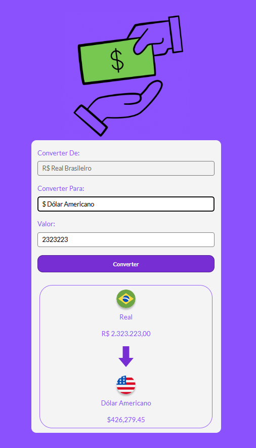
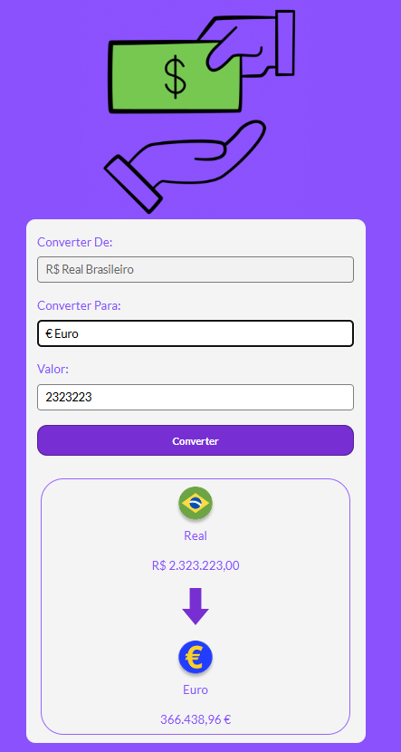
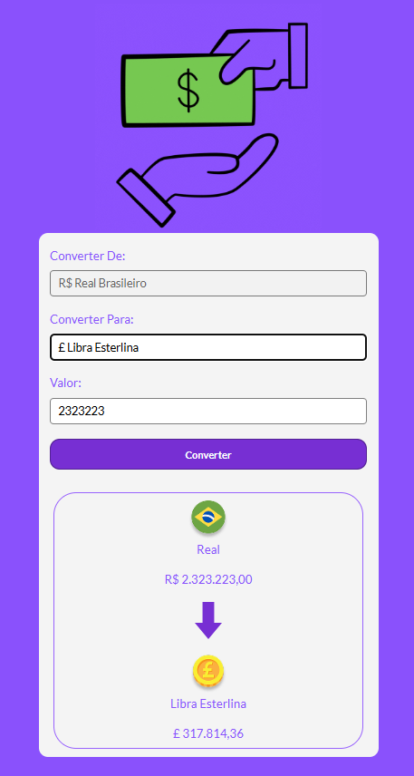
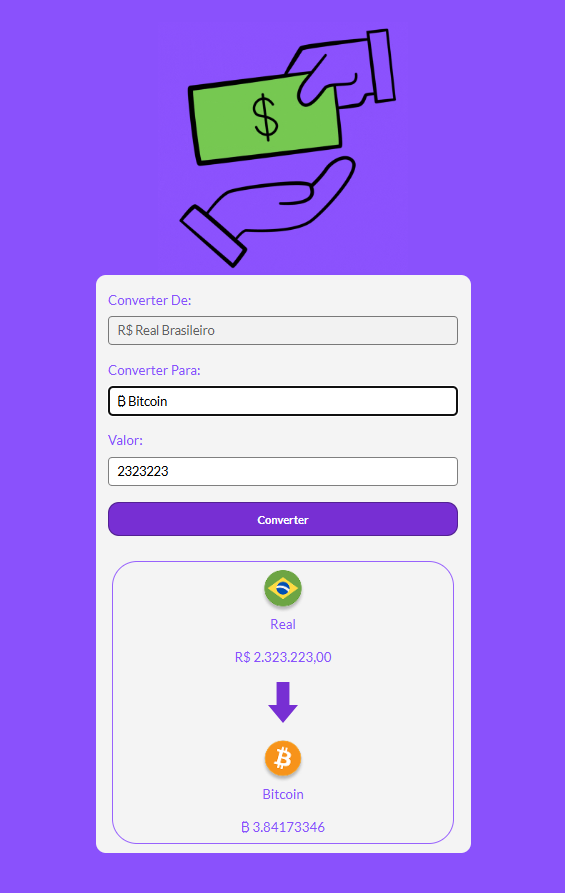

# Conversor de Moedas

## Descrição do Projeto

**Conversor de Moedas** é um projeto desenvolvido com o objetivo de aprimorar habilidades em **HTML, CSS e JavaScript**.  
Ele permite converter valores entre **Dólar, Libra Esterlina, Euro e Bitcoin**, fornecendo uma experiência prática de manipulação de valores e formatação de moedas.  

> ⚠️ Observação: as cotações utilizadas são **fixas**, não refletem valores em tempo real.  

Este projeto demonstra capacidade de criar interfaces interativas, atualizar conteúdos dinamicamente no DOM e aplicar boas práticas de formatação e design, sendo uma excelente adição ao portfólio de um desenvolvedor front-end.

---

## Tecnologias Utilizadas

- HTML
- CSS
- JavaScript

---

## Funcionalidades

- Conversão de valores entre diferentes moedas (Dólar, Libra, Euro e Bitcoin)
- Atualização dinâmica do valor convertido ao alterar a moeda ou o valor
- Exibição do nome da moeda e ícone correspondente
- Interface simples e intuitiva

---

### Visuaização do Projeto
----------------------
* 

* 

* 

* 


1. Clone este repositório:
```bash
git clone https://github.com/enocmarvaoo-rgb/convertor-money.git